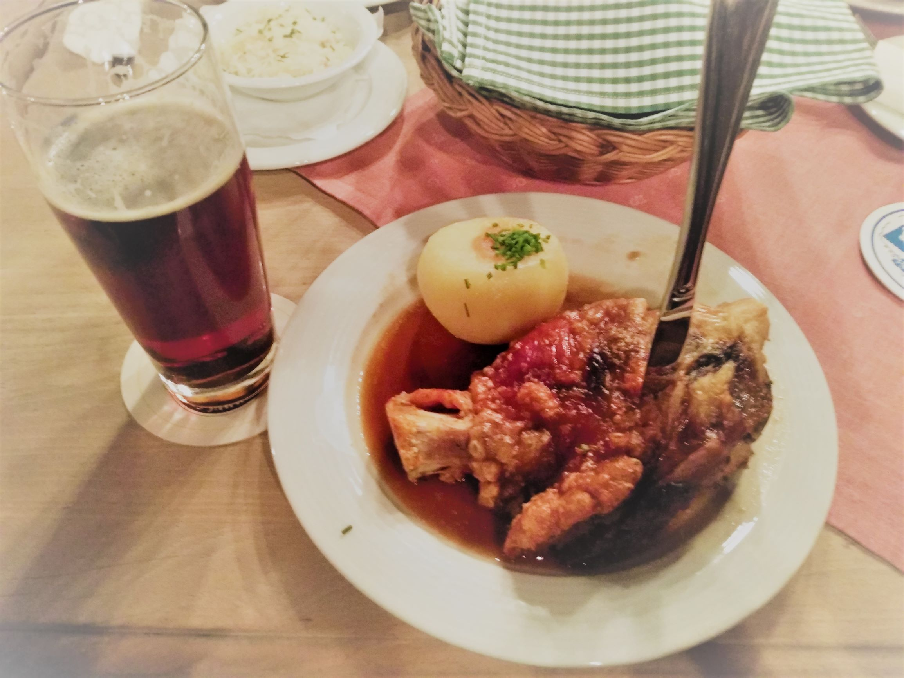

# 这里记录了我的一些笔记！

*Schweinshaxe und Bier.*

## Linux小技巧
- [vim插件](./linux/vim插件/vim插件.md)
- [git常用命令](./linux/git常用命令/git常用命令.md)
- [Linux批量更改或替换文件方法](./linux/Linux批量更改或替换文件方法.md)
- [Linux批量提交job方法](./linux/一次性提交多个job的方法/一次性提交多个job的方法.md) ([源文件](./linux/一次性提交多个job的方法/mulgo))

## Matlab小技巧
- [超级有用的matlab命令](matlab/超级有用的matlab命令.md)
- [尝试向量化调用ode45](matlab/向量化调用ode45/try_vectrorized_ode45.html) （[源文件](matlab/向量化调用ode45/try_vectrorized_ode45.mlx)）

## Mathematica小技巧
- [用MMA画动画](MMA/用MMA画动画/用MMA画动画.pdf) （[源文件](MMA/用MMA画动画/PlotMovieWithMMA.nb)）