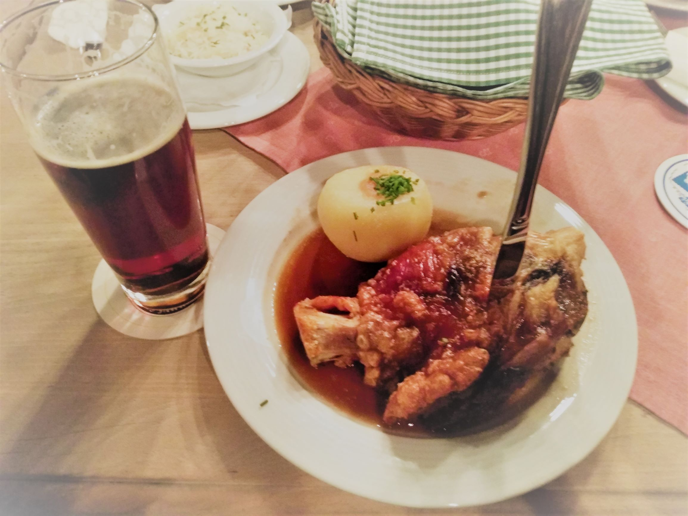

  <h1 style="font-size: 2.5em; margin-bottom: 10px; color: #2c3e50;">✨ 我的个人主页 ✨</h1>
  
记录科研、教学与生活中的点滴思考

  
  
Schweinshaxe und Bier. 生活与科研，同样精彩。

  <!-- 研海拾贝卡片 -->
  

    <a href="./research/index.md" style="text-decoration: none; color: inherit;">
      
      

        <h3 style="margin: 0 0 10px 0; color: #2c3e50;">🔬 研海拾贝</h3>
        
记录科研工作中的技术笔记、工具技巧和工作成果

      

    </a>
  

  <!-- 大学物理教学卡片 -->
  

    <a href="./teaching/index.md" style="text-decoration: none; color: inherit;">
      
      

        <h3 style="margin: 0 0 10px 0; color: #2c3e50;">📚 大学物理</h3>
        
大学物理课程资料、知识点讲解、习题解析

      

    </a>
  

  <!-- 数理趣谈卡片 -->
  

    <a href="./popular/index.md" style="text-decoration: none; color: inherit;">
      
      

        <h3 style="margin: 0 0 10px 0; color: #2c3e50;">✨ 数理趣谈</h3>
        
有趣的数学、物理小知识和趣味故事，领略科学魅力

      

    </a>
  

 

 

> 提示：你可以后续将三张图片替换为自己喜欢的图片，只需要将上面的图片链接替换为本地图片路径即可。

